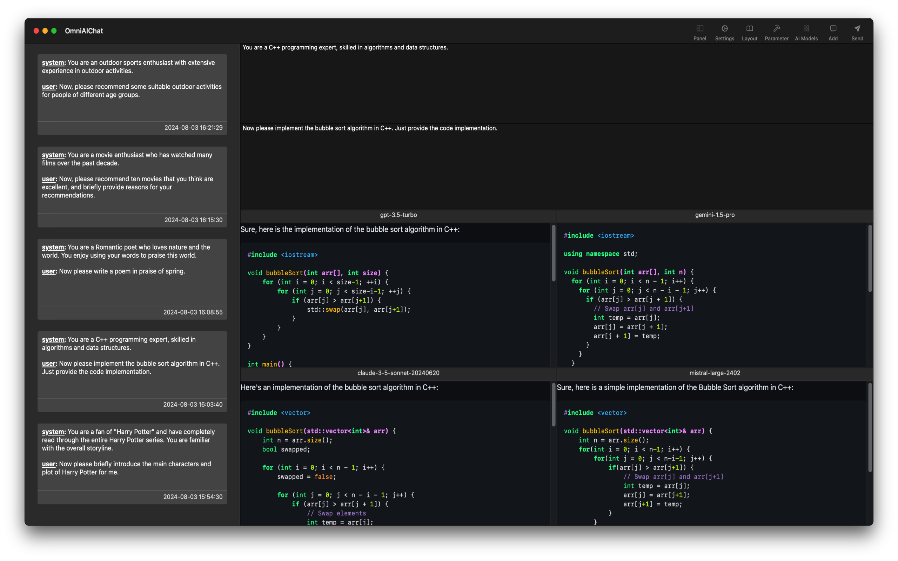

# OmniAIChat

## Overview

All-in-one AI chat utility, support OpenAI ChatGPT, Anthropic Claude, Google Gemini, Mistral.

## Features

All-in-one AI chat tool.

- You only need to enter the prompt word once to connect to the chat services of openai, anthropic, gemini, mistral at the same time. It is simple, efficient and easy to use.

- Supports multiple large language models provided by openai, anthropic, gemini, mistral.

- Supports response data display based on streaming mode, and real-time display of chat response data.

- Supports chat history data display, supports copying, editing, and exporting chat record data.

- Supports large language model parameter customization, and obtains different chat response data by adjusting parameters.

- Supports color highlighting to display chat content, which is more visually beautiful.

- Supports dark and light modes of UI interface, and one-click to switch color modes.

- Supports setting network proxy to provide more flexible network access methods.

## Product Screenshots

#### Chat with AI

---

#### Chat Model

---

#### Dark UI Theme

---

© 2024 YMTECH. All rights reserved.
